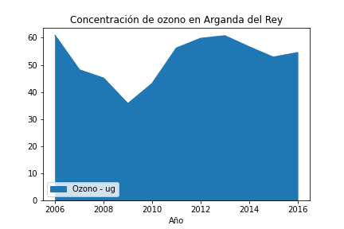

# Práctica 4
## Introducción
Este es un documento explicativo sobre la **práctica 4** (de la asignatura Periodismo de Datos en la Universidad Carlos III de Madrid) que se haya adjunta en este mismo repositorio de GitHub en formato [html](python-api-libre-pandas.html) e [ipynb](python-api-libre-pandas.ipynb)
En este documento **no** se ahondará en cada paso técnico llevado a cabo en la práctica, ya que estos comentarios ya se detallan en los propios documentos en formato html e ipynb que hemos mencionado. Se trata más bien de una reflexión sobre la **utilidad y aplicabilidad** de la práctica para un futuro desempeño profesional, así como las dificultades que se han encontrado en el proceso.
## Descripción (qué hemos hecho)
Para la práctica 4 se nos pedía que escogiésemos de forma **libre** un conjunto de datos con el que trabajar, **analizásemos los datos**, creásemos una **visualización** y **esbozásemos una historia** con ellos. La metodología se basaría en aquello que ya habíamos hecho en la [práctica 3](python-api-covid19-pandas%20(1).ipynb), diferenciándose en que esta vez éramos nosotros los que buscabamos los datos y que teníamos que esbozar una historia con ellos (además de adaptar la exploración y la visualización a las características que tuviese nuestro dataset en concreto). De nuevo, trabajamos en un cuaderno de **Jupyter** con **pandas** y lenguaje **JSON** (aunque también quedaba abierta la posibilidad de hacerlo con csv).
## Aplicabilidad (qué entendemos que hemos hecho)
La aplicabilidad queda muy patente en esta práctica gracias al "esbozo de historia" que proponemos. A través de la página de [datos abiertos del Gobierno de España](https://datos.gob.es/es) podemos acceder a una gran cantidad de datasets de manera sencilla y gratuita con los que poder trabajar, analizando los datos y creando las visualizaciones como ya habíamos aprendido en la práctica anterior. Podemos además filtrarlos por categoría, formato o publicador (entre otros) sobre la base de nuestros intereses. Haber escogido nosotros los datos abre un mundo de posibilidades para crear nuevas historias según nuestras preferencias o necesidades en un desempeño profesional posterior. Tras analizar y ordenar los datos, crear la visualización es muy ilustrativo del valor de los mismos y cómo conseguir una rápida comprensión de ellos para nuestros potenciales lectores. 

Por último, la historia esbozada deja patente la aplicabilidad de los datos en una información contextual más amplia, en este caso, los peligros de la concentración de O3 en el aire, sobre todo ahora que aumentan con la llegada del verano, y cómo intentar reducir ese incremento y las consecuencias nocivas para la salud que podemos sufrir por ello.
## Perspectivas de futuro (qué nos falta por entender)
Volver a hacer una práctica con metodología análoga a la práctica 3 ha servido para **afianzar conocimientos y comprender mejor**, precisamente, aquello que señalabamos en este mismo apartado en el documento de la [práctica 3](practica-3.md). Además, hemos explorado **otras potencialidades** que no hemos visto en clase, como la función `at` para cambiar los datos con los que no podíamos crear la visualización. Realmente, en consonancia con el espíritu de este tipo de prácticas, es relativamente sencillo ampliar información a través de internet y descubrir qué más cosas podemos hacer para seguir aprendiendo.
Sí me gustaría hacer una mención aparte sobre el portal de datos del gobierno. Aunque la iniciativa es muy interesante y veo muy enriquecedor la cantidad de datos que se vuelcan y en formatos muy variados, es cierto que es necesario que se corrijan muchos errores. En el formato de JSON, por ejemplo, del INE (sin ir más lejos) los valores están, por decirlo de alguna manera, "invertidos", es decir, en lugar de mostrar las columnas como las hemos usado en clase, es como si ordenase los datos en filas y, entonces, no podemos (o no sabemos cómo) utilizarlos. Buscando en internet (igual que lo hice para modificar los datos con `at`) no he llegado a ninguna página que dé una respuesta. Otros datos de otras instituciones no podían ni siquiera abrirse y otras url daban error cuando se intentaban ejecutar. Me parece algo preocupante porque había errores que no eran cuestión de una API en concreto, sino que eran sistemáticos de cada publicador. Creo que **hay mucho que mejorar en cuanto al acceso de datos "abiertos" en España**.
